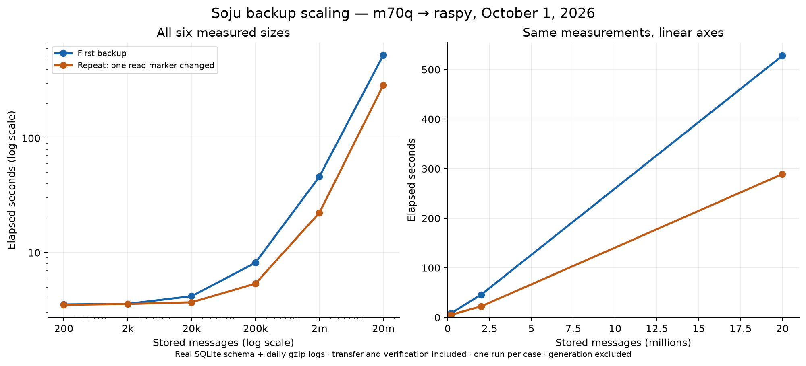

# Backup scaling measurements — October 1, 2026

The current backup's work grows with retained history. Reusing unchanged
compressed logs saves work and storage, but copying/checking the SQLite database,
scanning files and fully verifying payloads still process accumulated data.

## Measured results

| Messages | Daily log files | SQLite DB | First (s) | Read-marker repeat (s) | Peak Python RSS (MiB) |
| ---: | ---: | ---: | ---: | ---: | ---: |
| 200 | 34 | 260.00 KiB | 3.527 | 3.495 | 50.3 |
| 2,000 | 34 | 1.02 MiB | 3.570 | 3.558 | 52.3 |
| 20,000 | 68 | 8.64 MiB | 4.165 | 3.682 | 62.8 |
| 200,000 | 680 | 86.01 MiB | 8.162 | 5.366 | 125.3 |
| 2,000,000 | 6,800 | 851.10 MiB | 45.951 | 22.228 | 149.4 |
| 20,000,000 | 68,000 | 8.37 GiB | 527.936 | 289.173 | 508.6 |

**Read-marker repeat:** change one read receipt, leave all messages and log files
unchanged, and run with the previous completed snapshot available for reuse.
It is not the fully unchanged case. All six sizes completed actual local and
remote backup verification successfully.

The 20-million-message first snapshot contains 2.87 GiB
of logical compressed payloads and metadata. Snapshot sizes count a complete
view, including hard-linked files, and are not marginal disk allocation.
On raspy, the 2-million-message repeat shared **6,801 payloads** with the first
snapshot through hard links; only the database payload had a new inode.

## Fully unchanged control

A separate 2-million-message dataset was backed up twice without changing any
source between runs. The second backup still took **17.640
seconds**, with **11.346 seconds of local CPU time** and
**126.5 MiB peak Python RSS**. See
[the control measurements](unchanged.jsonl). This control ran after the six-size
sweep, without competing with its generation or backup operations.

All **6,802 payloads**, including the database, were hard-linked to the preceding
snapshot on raspy. This was verified by comparing inode numbers after timing.

An unchanged-source backup currently still copies and checks SQLite, reads source
hashes, validates reused payloads, creates the snapshot view and performs remote
checks. Payload reuse is not an early no-op decision.

## Hashing observation

One SHA-256 pass over the 851.10 MiB database took
**0.849 seconds** (1002 MiB/s).
The filesystem cache was not flushed. This was measured while the larger source
was being generated, outside all timed backup operations. It demonstrates that
hashing is fast per byte but still requires reading the entire file; it is not
a millisecond shortcut for gigabytes of unchanged data.

## Method

- Source: m70q, Intel Core i5-11400T, 12 logical CPUs, approximately 15 GiB RAM,
  NVMe storage. Destination: raspy, aarch64, approximately 3.7 GiB RAM,
  `/dev/sda2`, over the existing LAN.
- Backup implementation: `a333140`; the installed runner and snapshot module
  hashes matched the repository. Python 3.14.7 on m70q.
- Real pinned Soju schema, including indexes, FTS and insertion triggers.
  The generator checked the actual Message row count at every requested size.
- One synthetic IRC PRIVMSG and one exported line per record. Content is selected
  deterministically from 65,536 phrases built from 253 words, with varying
  senders and occasional numeric references. Compression ratios will differ
  from actual IRC conversations.
- 34 channels, 10,000 messages per day, daily gzip exports. At 20 million records
  this is 2,000 days and 68,000 log files. Changing this distribution changes
  metadata overhead independently of message count.
- Each size starts without a previous local snapshot; the repeat can reuse its
  own first snapshot. Remote delivery uses a dedicated disposable receiver.
- Timed: the real `create_backup()`, including staging, SQLite online backup and
  checks, compression/reuse, local full verification, rsync upload and checksum
  checks, completion receipts and local retention.
- Excluded: dataset generation, Python process startup and post-run size scans.
  Every measurement runs in a fresh Python process; reported RSS excludes the
  generator. CPU includes local subprocesses but not raspy's CPU time. RSS is
  the Python process only, not combined memory use across both hosts.
- Processes ran with `nice 10` and `ionice -c 2 -n 7`. Other normal services
  remained running. There was no cache flush, and each case was measured once.
  These are paired observations, not medians or latency percentiles.
- Settings, the recovery toolkit and the fixed pre-July archive corpus were not
  included. Their cost is additional to this growing-history workload.

The small cases show approximately 3.5 seconds of fixed overhead. At larger
sizes, accumulated data and file count dominate. The largest case also encounters
different cache and I/O conditions; these measurements do not establish an exact
linear formula for all future sizes.

## Reproduction and next step

See [the benchmark instructions](../../README.md) and
[the runner](../../backup.py). Raw data is retained in [JSONL](results.jsonl),
[CSV](results.csv), [environment metadata](environment.json) and
[hardware notes](hardware.json). An exportable [SVG chart](scaling.svg) is included.

The proposed [fast no-op design](../../no-op-design.md) separates local change
detection from periodic full verification. No watcher or new verification
schedule was deployed as part of this benchmark. A fast no-op alone would not
make a daily backup with new IRC messages incremental; the SQLite snapshot and
full directory publication would need separate changes.

Synthetic databases, log trees and remote snapshots were removed after collecting
the measurements. The dedicated benchmark SSH key was revoked and deleted.
Production Soju, WeeChat and backup data were left unchanged.
